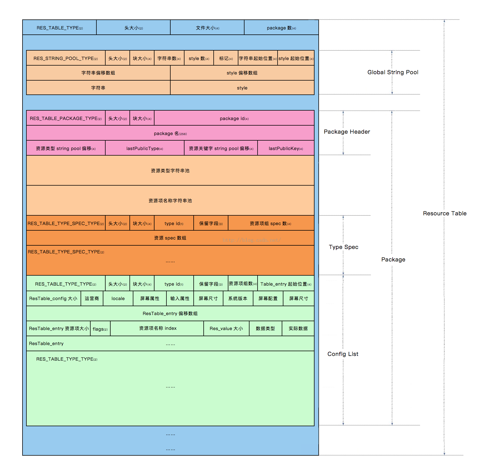
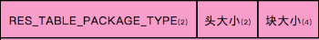
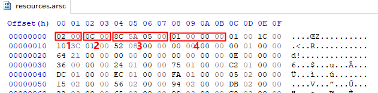
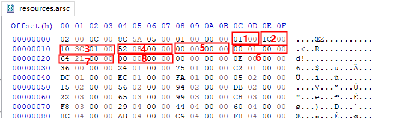
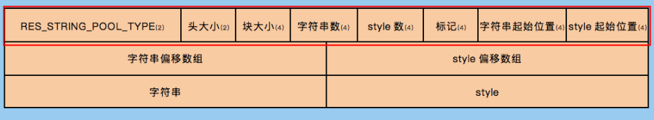
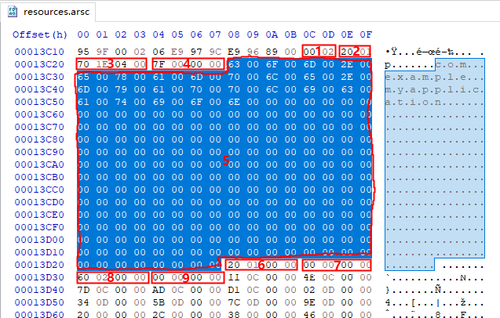
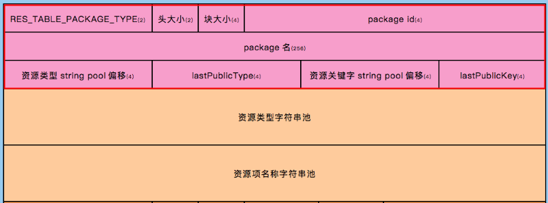

# resource.arsc资源文件解析

## 获取resources.arsc
```
erlin@erlin-Terrans-Force-S5:release$ apktool d -r app-release.apk 
I: Using Apktool 2.4.1-dirty on app-release.apk
I: Copying raw resources...
I: Baksmaling classes.dex...
I: Copying assets and libs...
I: Copying unknown files...
I: Copying original files...
```
目录：
```
erlin@erlin-Terrans-Force-S5:app-release$ ll
total 380
drwxr-xr-x  5 erlin erlin   4096 3月  21 12:06 ./
drwxrwxr-x  3 erlin erlin   4096 3月  21 12:06 ../
-rw-r--r--  1 erlin erlin   2244 3月  21 12:06 AndroidManifest.xml
-rw-r--r--  1 erlin erlin   8659 3月  21 12:06 apktool.yml
drwxr-xr-x  3 erlin erlin   4096 3月  21 12:06 original/
drwxr-xr-x 44 erlin erlin   4096 3月  21 12:06 res/
-rw-r--r--  1 erlin erlin 350460 3月  21 12:06 resources.arsc
drwxr-xr-x  5 erlin erlin   4096 3月  21 12:06 smali/
```



注：resources.arsc 文件格式的数据结构定义：android-4.1.1_r1/frameworks/base/include/androidfw/ResourceTypes.h

根据ResourceTypes.h文件结构，转换成的Java文件结构如下：
```Java
./src/com/erlin/parse/androidArsc/type
├── ./src/com/erlin/parse/androidArsc/type/ResChunkHeader.java
├── ./src/com/erlin/parse/androidArsc/type/ResourceType.java
├── ./src/com/erlin/parse/androidArsc/type/ResStringPoolHeader.java
├── ./src/com/erlin/parse/androidArsc/type/ResStringPoolRef.java
├── ./src/com/erlin/parse/androidArsc/type/ResStringPoolSpan.java
├── ./src/com/erlin/parse/androidArsc/type/ResTableConfig.java
├── ./src/com/erlin/parse/androidArsc/type/ResTableEntry.java
├── ./src/com/erlin/parse/androidArsc/type/ResTableHeader.java
├── ./src/com/erlin/parse/androidArsc/type/ResTableMapEntry.java
├── ./src/com/erlin/parse/androidArsc/type/ResTableMap.java
├── ./src/com/erlin/parse/androidArsc/type/ResTablePackage.java
├── ./src/com/erlin/parse/androidArsc/type/ResTableRef.java
├── ./src/com/erlin/parse/androidArsc/type/ResTableType.java
├── ./src/com/erlin/parse/androidArsc/type/ResTableTypeSpec.java
└── ./src/com/erlin/parse/androidArsc/type/ResValue.java
```

有了上面的逆向结构体，就可以进行下面逆向工作工具了。

## 一、ResChunk_header -> ResChunkHeader基本结构体

resources.arsc文件是有一系列的Chunk构成，每一个chunk均包含如下结构的ResChunk_header,用来描述这个chunk的基本信息，因此
ResChunk_header是每个chunk的基本结构体。




ResChunkHeader的代码如下：
```Java
package com.erlin.parse.androidArsc.type;

/**
 * ResourceTypes.h -> struct ResChunk_header
 */
public class ResChunkHeader {
    public short type;//2个字节
    public short headerSize;//2个字节
    public int size;//4个字节

    public int getOffsets(){
        return 2+2+4;
    }

    @Override
    public String toString() {
        return "ResChunkHeader{" +
                "type=" + type +
                ", headerSize=" + headerSize +
                ", size=" + size +
                '}';
    }
}

```
1. type: ChunkType类型，固定占用2个字节
2. headerSize：ChunkHeader的ChunkSize大小，固定占用2个字节
3. size：该段Chunk的大小

ResChunk_header解析代码：

```Java
public static ResChunkHeader getResourceChunkHeader(byte[] bytes, short type, int offsets) {
    ResChunkHeader mResChunkHeader = new ResChunkHeader();
    mResChunkHeader.type = type;
    mResChunkHeader.headerSize = Utils.bytes2Short(Utils.copyBytes(bytes, offsets + 2, 2));
    mResChunkHeader.size = Utils.bytes2Int(Utils.copyBytes(bytes, offsets + 4, 4));
    return mResChunkHeader;
}
```

## 二、ResTable_header -> ResTableHeader解析分析

resources.arsc的Resource Table Header Chunk如下结构体：
```Java
package com.erlin.parse.androidArsc.type;

/**
 * ResourceTypes.h -> struct ResTable_header
 */

public class ResTableHeader {
    public ResChunkHeader resChunkHeader;
    public int packageCount;

    @Override
    public String toString() {
        return "ResTableHeader{" +
                "resChunkHeader=" + resChunkHeader +
                ", packageCount=" + packageCount +
                '}';
    }
}
```



1. resChunkHeader:Chunk的头部信息结构
    * type: Resource Table Header Chunk 类型：0x0002
    * headerSize:Resource Table Header Chunk Size 的大小：0x000C
    * size:Resource Table Chunk Size的大小，在此资源段内，代表整个resources.arsc文件大小
2. packageCount: 编译的资源包的个数。一般情况下只有一个资源包，就是应用包名所在的资源包。

```Java
public static ResTableHeader parseResourcTableTypeChunk(byte[] bytes) {
    if (!Utils.checkBytes(bytes)) {
        return null;
    }
    ResTableHeader mResTableHeader = new ResTableHeader();
    mResTableHeader.resChunkHeader = getResourceChunkHeader(bytes, ResourceType.RES_TABLE_TYPE, offsets);
    mResTableHeader.packageCount = Utils.bytes2Int(Utils.copyBytes(bytes, offsets + 8, 4));
    return mResTableHeader;
}
```
## 二、资源字符串池ResStringPool_header -> ResStringPoolHeader Chunk解析：

```Java
public class ResStringPoolHeader {
    public static final int SORTED_FLAG = 1<<0;
    public static final int UTF8_FLAG = 1<<8;

    public ResChunkHeader resChunkHeader;
    public int stringCount;//字符串总数
    public int styleCount;//字符串样式总数
    public int flags;//标志
    public int stringsStart;//字符串内容相对于头部的偏移量
    public int stylesStart;//字符串样式内容相对于头部的偏移量

    //提取String，存放到mStringPool中
    public ArrayList<String> mStringPool;
    //提取Style，存放到mStylePool中
    public ArrayList<String> mStylePool;

    public int getOffsets(){
        return resChunkHeader.getOffsets()+4+4+4+4+4;
    }

    @Override
    public String toString() {
        return "ResStringPoolHeader{" +
                "resChunkHeader=" + resChunkHeader +
                ", stringCount=" + stringCount +
                ", styleCount=" + styleCount +
                ", flags=" + flags +
                ", stringsStart=" + stringsStart +
                ", stylesStart=" + stylesStart +
                '}';
    }
}
```



1. resChunkHeader:Chunk的头部信息结构
    * type: Resource String Pool Header Chunk 类型：0x0001
    * headerSize:Resource  String Pool Header Chunk Size 的大小：0x001C
    * size:Resource String Pool Chunk Size的大小，在此资源段内，代表整个String Pool池大小
2. stringCount:字符串总数,固定4字节
3. styleCount:字符串样式总数,固定4字节
4. flags:标志,固定4字节
5. stringsStart:字符串内容相对于头部的偏移量,固定4字节
6. stylesStart:字符串样式内容相对于头部的偏移量,固定4字节

### 字符串偏移数组
字符串偏移数组是计算每个字符串的偏移位置，用于提取字符串。
ResStringPoolHeader结构体中stringsStart就是字符串偏移数组的结束位置。

每个字符串的偏移位置计算代码：
```Java
//提取每个字符串的偏移位置
int[] stringIndexArray = new int[mResStringPoolHeader.stringCount];
int stringOffsets = offsets + 20;
for (int i = 0; i < mResStringPoolHeader.stringCount; i++) {
    stringIndexArray[i] = Utils.bytes2Int(Utils.copyBytes(bytes, stringOffsets + i * 4, 4));
}
```

### 样式串偏移数组
样式串偏移数组是计算每个样式串的偏移位置，用于提取样式字符串。
ResStringPoolHeader结构体中stylesStart就是字符串偏移数组的结束位置。

每个样式字符串的偏移位置计算代码：
```Java
//提取每个样式串的偏移位置
int[] styleIndexArray = new int[mResStringPoolHeader.styleCount];
int styleOffsets = stringOffsets + mResStringPoolHeader.stringCount * 4;
for (int i = 0; i < mResStringPoolHeader.styleCount; i++) {
    styleIndexArray[i] = Utils.bytes2Int(Utils.copyBytes(bytes, styleOffsets + i * 4, 4));
}
```

### 提取字符串和样式串
有字符串偏移数组和样式串偏移数组就可以用来提取字符串和样式串，提取代码如下：
```Java
public static int extractStringList(ArrayList<String> arrayList,byte[] bytes,int count,int position){

    for(int i=0;i<count;i++){
        byte[] styleLenByte = Utils.copyBytes(bytes,position,2);
        int strLen = styleLenByte[1]&0x7F;
        String stringContent = "";
        if(strLen != 0){
            try {
                stringContent = new String(Utils.copyBytes(bytes,position+2,strLen),"utf-8");
            } catch (UnsupportedEncodingException e) {
                System.out.println(e.getMessage());
            }
        }
        arrayList.add(stringContent);
        position+=strLen+3;
        
    }

    return position;
}
```

ResStringPoolHeader Chunk段的解析代码如下：
```Java
public static ResStringPoolHeader parseResourceStringPoolHeaderChunk(byte[] bytes, int offsets) {
    if (!Utils.checkBytes(bytes)) {
        return null;
    }
    ResStringPoolHeader mResStringPoolHeader = new ResStringPoolHeader();
    mResStringPoolHeader.resChunkHeader = getResourceChunkHeader(bytes, ResourceType.RES_STRING_POOL_TYPE, offsets);
    mResStringPoolHeader.stringCount = Utils.bytes2Int(Utils.copyBytes(bytes, offsets + 8, 4));
    mResStringPoolHeader.styleCount = Utils.bytes2Int(Utils.copyBytes(bytes, offsets + 12, 4));
    mResStringPoolHeader.flags = Utils.bytes2Int(Utils.copyBytes(bytes, offsets + 16, 4));
    mResStringPoolHeader.stringsStart = Utils.bytes2Int(Utils.copyBytes(bytes, offsets + 20, 4));
    mResStringPoolHeader.stylesStart = Utils.bytes2Int(Utils.copyBytes(bytes, offsets + 24, 4));

    mResStringPoolHeader.mStringPool = new ArrayList<>(mResStringPoolHeader.stringCount);
    mResStringPoolHeader.mStylePool = new ArrayList<>(mResStringPoolHeader.styleCount);

    //提取每个字符串的偏移位置
    int[] stringIndexArray = new int[mResStringPoolHeader.stringCount];
    int stringOffsets = offsets + 20;
    for (int i = 0; i < mResStringPoolHeader.stringCount; i++) {
        stringIndexArray[i] = Utils.bytes2Int(Utils.copyBytes(bytes, stringOffsets + i * 4, 4));
    }

    //提取每个样式串的偏移位置
    int[] styleIndexArray = new int[mResStringPoolHeader.styleCount];
    int styleOffsets = stringOffsets + mResStringPoolHeader.stringCount * 4;
    for (int i = 0; i < mResStringPoolHeader.styleCount; i++) {
        styleIndexArray[i] = Utils.bytes2Int(Utils.copyBytes(bytes, styleOffsets + i * 4, 4));
    }

    //提取字符串池
    int stringContentIndex = styleOffsets + mResStringPoolHeader.styleCount * 4;
    stringContentIndex = extractStringList(mResStringPoolHeader.mStringPool, bytes, mResStringPoolHeader.stringCount, stringContentIndex);

    //提取字符样式串
    extractStringList(mResStringPoolHeader.mStylePool, bytes, mResStringPoolHeader.styleCount, stringContentIndex);

    return mResStringPoolHeader;
}
```

## 三、RES_TABLE_PACKAGE_TYPE ResTablePackage Chunk解析：
解析资源包信息的Chunk结构：
```Java
package com.erlin.parse.androidArsc.type;

import java.util.Arrays;

/**
 * ResourceTypes.h -> struct ResTable_package
 */

public class ResTablePackage {
    public ResChunkHeader resChunkHeader;
    public String packageName;
    public int packageId;
    public char[] name = new char[128];
    public int typeStrings;
    public int lastPublicType;
    public int keyStrings;
    public int lastPublicKey;

    @Override
    public String toString() {
        return "ResTablePackage{" +
                        "resChunkHeader=" + resChunkHeader +
                        ", packageName='" + packageName + '\'' +
                        ", packageId=" + packageId +
                        ", name=" + Arrays.toString(name) +
                        ", typeStrings=" + typeStrings +
                        ", lastPublicType=" + lastPublicType +
                        ", keyStrings=" + keyStrings +
                        ", lastPublicKey=" + lastPublicKey +
                        '}';
    }
}
```





1. resChunkHeader:Chunk的头部信息结构
    * type: Resource Table Package Header Chunk 类型：0x0200
    * headerSize:Resource Table Package Header Chunk Size 的大小：0x0120
    * size:Resource Table Package Chunk Size的大小，在此资源段内，代表整个TablePackage大小
2. packageId:应用包ID，非系统应用资源包ID为0x7F，系统资源包ID为0x01
3. packageName:应用包名
4. typeStrings:资源类型字符串池相对于头部的偏移值
5. lastPublicType:最后一个导出的Public类型字符串在类型字符串资源池中的索引，目前这个值设置为类型字符串资源池的元素个数。在解析的过程中没发现他的用途
6. keyStrings:资源项名称字符串池相对于头部的偏移值
7. lastPublicKey:最后一个导出的Public资源项名称字符串在资源项名称字符串资源池中的索引，目前这个值设置为资源项名称字符串资源池的元素个数。在解析的过程中没发现他的用途

### 资源类型字符串池解析

### 资源项名称字符串池解析

RES_TABLE_PACKAGE_TYPE的Chunk段的解析代码：
```Java
```